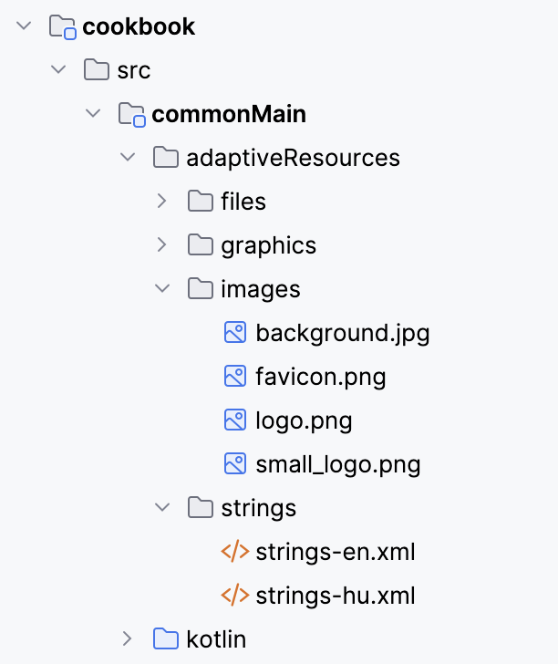

# What is the resource subsystem

[todo: clean up what is the resource subsystem](todo://)

> [!IMPORTANT]
> 
> The new resource subsystem is tested only for browser. It should work on
> Android and iOS as well, but it is not tested on those platforms.
> 

The [resource subsystem](def://) is provided by [core-core](def://), used by the
[Gradle plugin](def://) to compile [resources](def://) and by [application](def://) code to
access the compiled resources.

It lets you define various resources used by the application:

* Documents
* Files
* Fonts
* Images
* Graphics
* Strings

Once set up, you can access these resources easily from application code.
Adaptive takes care of the resource pre-processing, code generation and publication.

```kotlin
@Adaptive 
fun someFun() {
    docDocument(Documents.someMarkdown)
    externalLink(Files.terms)
    // fonts are typically loaded independently
    icon(Graphics.add)
    image(Images.background)
    text(Strings.message)
}
```

If you are interested about under-the-hood mechanisms, check out the [Internals](../internals/resource.md).

## Setup

1) Create an `adaptiveResources` directory in source set you want to add the resources to.
2) Put the resources into the appropriate directories.
3) Add [bootstrap string loading](#strings) to your application.
4) Whenever you add a new resource
   1) run the `processAdaptiveResources<source-set-name>` Gradle task (from the`adaptive` group)



## Directories

You can organize your resources by qualifiers freely, see [Qualifiers](#qualifiers).

Note that the file names have the `_` character as name separator, check `withFileQualifiers` in
[Additional Configuration](#additional-configuration) for more info.

Basic setups (I like by environment more as it is much easier to copy):

* by type

```text
adaptiveResources
  documents
    intro.md
  files
    terms_and_conditions-hu.pdf
    terms_and_conditions-cs.pdf
  fonts
    open_sans.ttf
  images
    background.jpg
  graphics
    icon.svg
  strings
    strings-hu.xml
    strings-cs.xml
```

* by environment

```text
adaptiveResources
  hu
    files
        terms_and_conditions.pdf
    strings
        strings.xml
  cs
    files
        terms_and_conditions.pdf
    strings
        strings.xml
  hdpi
    images
        background.jpg
  mdpi
    images
        background.jpg
  images // you can put resolution independent images here (tiled for example)
    blue.png  
  graphics // SVG can be resolution independent
    icon.svg      
```

## Strings

To use strings you have to load them manually:

```kotlin
commonMainStringsStringStore0.load()
```

>
> [!NOTE]
>
> The manual load is a design decision which I think is correct. Loading strings is
> a suspending or blocking operation which I really don't want to deal with in general
> code.
>
> The name of the property to load is generated:
>
> `<source-set-name><file-name>StringStore0`
> 
> I'll try to figure out some better ways to deal with this but this is it for now.
>

String resources are stored in XML files, exactly the same as on Android:

```xml
<resources>
    <string name="app_name">Jó reggelt!</string>
    <string name="snooze">Szundi</string>
    <string name="sleepiness">Álmosság:</string>
    <string name="by_joining">A csatlakozással elfogadod a</string>
    <string name="terms_of_service">Szolgáltatás Szabályzatot</string>
    <string name="and">és az</string>
    <string name="privacy_policy">Adatkezelési Szabályzatot</string>
    <string name="what_an_odd_second">Micsoda páratlan másodperc!</string>
    <string name="you_are_sleepy">Nagyon álmos vagy ma!</string>
</resources>
```

## Qualifiers

- All resource types support qualifiers.
- Resource qualifiers are case-sensitive.
- Directory names are treated as qualifiers.
- Add qualifiers to files by adding a hyphen and the qualifier before the extension.

Examples:

```text
adaptiveResources/
    files/
        someFile.txt
        someFile-hu.txt
    files-cs-CZ/
        someFile-hdpi-light.txt
    cs-CZ/
        files/
            someFile-hdpi-dark.txt    
    someOtherFile-file.txt
```

If a resource with the requested qualifier doesn't exist:

- if a resource without qualifiers exists, it is used instead
- if no resource without qualifiers exists, you'll get a compilation error

If you have conflicting resources in different directories you'll get a compilation error.

### Language and regional qualifiers

The language is defined by:

- a two-letter (ISO 639-1)
- or a three-letter (ISO 639-2) language code

To specify the country, add a ISO 3166-1-alpha-2 country code with an `r` prefix, like `hu-rHU`.

The language and country codes are case-sensitive.

### Theme qualifier

- `light`
- `dark`

### Densities

- `ldpi` − 120 DPI, 0.75x density
- `mdpi` − 160 DPI, 1x density
- `hdpi` − 240 DPI, 1.5x density
- `xhdpi` − 320 DPI, 2x density
- `xxhdpi` − 480 DPI, 3x density
- `xxxhdpi` − 640dpi, 4x density


## Additional configuration

You can change the settings of the resource handling in the `adaptive` extension in `build.gradle.kts`.
The values here are the defaults, so you don't have to specify these explicitly.

```kotlin
adaptive {
    resources {
        packageOfResources = "<group-name>.<module-name>.generated.resources"
        artefactDirectory = "resources"
        publicAccessors = false
        withFileQualifiers = true
        withFileDefault = true
    }
}
```

`packageOfResources`

* The unique identifier of the resources in the current project. 
* Used as package for the generated code and for isolation resources in a final artefact.
* If it is empty then `{group name}.{module name}.generated.resources` will be used.

`artefactDirectory`

* The directory in the final artefact into which the puts the resource files. 
* If you change this you should also set the path resolver function in `WebResourcesConfiguration` or map the paths by other means.
* Default is `resources`.

`publicAccessors`

* Whether the generated resources accessors should be `public` or `internal`.
* Default is `false`.

`withFileQualifiers`

* Whether the file name may contain qualifiers. 
* This is useful if you want to put the same kind of files such as strings into one directory with names like `strings-hu.xml`.
* `true` means that you can't have `-` in file names as part after the `-` would be treated as a qualifier.
* Default is `true`.

`withFileDefault`

* Treat resources without type qualifier as File.
* This makes it possible to add files in the root resource package.
* Default is `true`.

## iOS

As of now, we have to copy the resources directory into the iOS app manually. This could be automatized with 
a Gradle task quite easily. 

The source is `build/kotlin-multiplatform-resources/aggregated-resources/iosArm64`.

This is how it should look like:


To include a folder in the iOS application bundle as-is, follow these steps:

* Xcode, open the project
* Right-click on the project in the Project Navigator and select "Add Files to ..."
* In the file dialog, navigate to and select the folder you want to add.
* In the options dialog, ensure the "Create folder references" option is selected instead of "Create groups". This keeps the folder structure intact.
* Click "Add".

## Credit

The resource subsystem is started from the code of the Compose resource plugin. Unfortunately, 
Compose resources is so closely tied with Compose that it is basically impossible to use them
independently. Also, it generates a crazy amount of code which I don't like. Hence, I decided to
rewrite it.