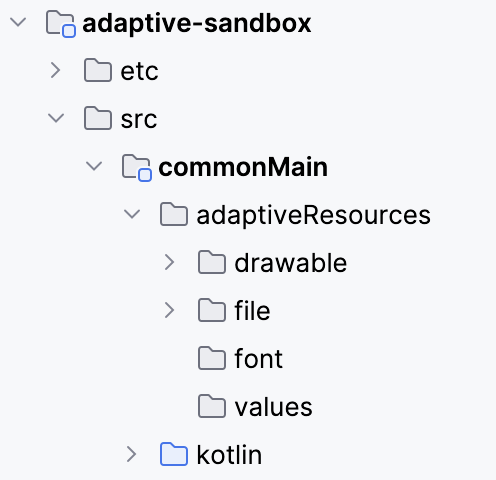
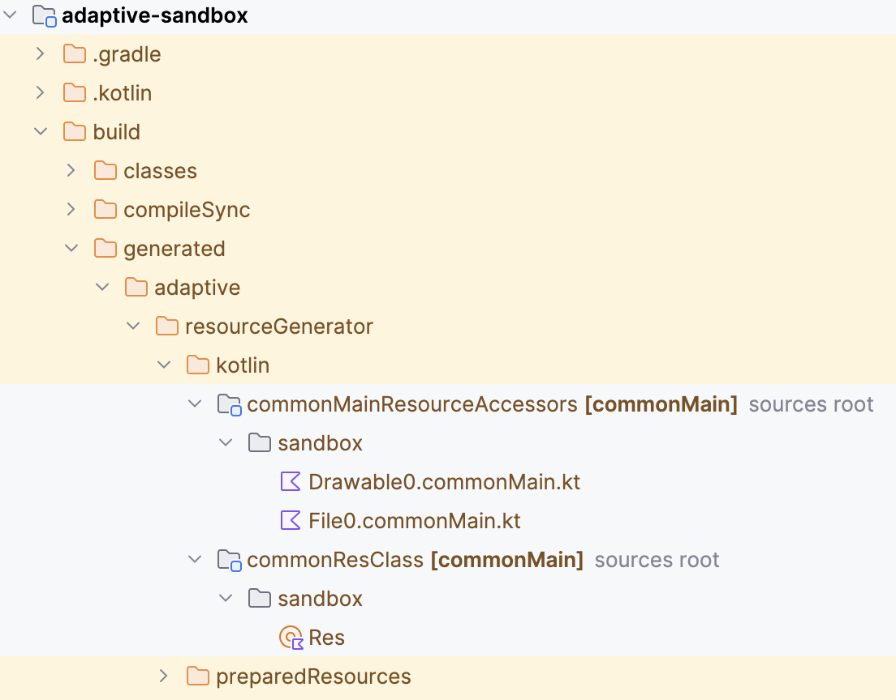
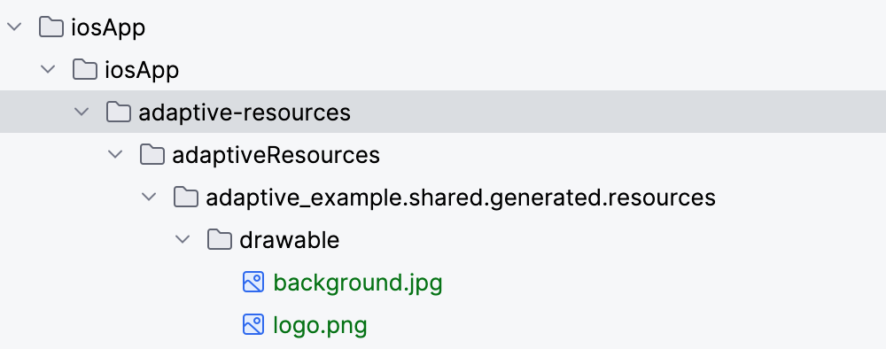

# Resources

> [!NOTE] 
> 
> The resource package is a copy of Compose resources package. I decided to make a copy
> as Compose resources are very strongly tied to Compose itself and is pretty hard
> to extend because of all sealed, internal, private etc.
>
> That said, I've already added changes and extensions to suit our needs, so while
> the package is very similar for now, it will diverge in the future.
> 

## Setup

Resource support is part of the core module and the standard Adaptive Gradle plugin.

To add resources create an `adaptiveResources` directory the source set you want 
to add the resources to:



Change the settings of the resource handling in the `adaptive` extension in `build.gradle.kts`:

```kotlin
adaptive {
    resources {
        publicResClass = true
        packageOfResClass = "some.library.resources"
        generateResClass = always
    }
}
```

`publicResClass`
  - `true` = generated `Res` class is public
  - `false` = generated `Res` class is internal
  - default: `false`

`packageOfResClass`
  - package to generate the `Res` class into
  - default: `<group name>.<module name>.generated.resources`

`generateResClass`
   - `always` - generate the `Res` class
   - `auto` - generate the `Res` class
   - `never` - do not generate the `Res` class
   - default: `auto`

## Qualifiers

- All resource types support qualifiers.
- Resource qualifiers are case-sensitive.
- Directory names are treated as qualifiers.
- Add qualifiers to files by adding a hyphen and the qualifier before the extension.

Examples:

```text
adaptiveResources/
    files/
        someFile.txt
        someFile-hu.txt
    files-cs-CZ/
        someFile-hdpi-light.txt
    cs-CZ/
        files/
            someFile-hdpi-dark.txt    
```

If a resource with the requested qualifier doesn't exist:

- if a resource without qualifiers exists, it is used instead
- if no resource without qualifiers exists, you'll get a compilation error

If you have conflicting resources in different directories you'll get a compilation error.

### Language and regional qualifiers

The language is defined by:

- a two-letter (ISO 639-1) 
- or a three-letter (ISO 639-2) language code

To specify the country, add a ISO 3166-1-alpha-2 country code with an `r` prefix, like `hu-rHU`.

The language and country codes are case-sensitive.

### Theme qualifier

- `light`
- `dark`

### Densities

- `ldpi` − 120 DPI, 0.75x density
- `mdpi` − 160 DPI, 1x density
- `hdpi` − 240 DPI, 1.5x density
- `xhdpi` − 320 DPI, 2x density
- `xxhdpi` − 480 DPI, 3x density
- `xxxhdpi` − 640dpi, 4x density

### Sources

Check these files to see how the given qualifier is retrieved on the given platform:

| Platform | Class                                                                                                           |
|----------|-----------------------------------------------------------------------------------------------------------------|
| android  | [withAndroidResources.kt](/adaptive-ui/src/androidMain/kotlin/fun/adaptive/ui/platform/withAndroidResources.kt) |
| ios      | [withIosResources.kt](/adaptive-ui/src/iosMain/kotlin/fun/adaptive/ui/platform/withIosResources.kt)             |
| browser  | [withJsResources.kt](/adaptive-ui/src/jsMain/kotlin/fun/adaptive/ui/platform/withJsResources.kt)                |

## Res class

The `Res` class is generated by these:

- project import into IDEA
- `./gradlew build`
- `./gradlew generateAdaptiveResClass`

You can find the class in the `build\generated` directory:



## Using resources

You can simply use the resource items directly in adaptive functions which support them:

```kotlin
@Adaptive 
fun bg() {
    image(R.drawable.background)
}
```

## iOS

As of now, we have to copy the resources directory into the iOS app manually. This could be automatized with 
a Gradle task quite easily. 

The source is `build/kotlin-multiplatform-resources/aggregated-resources/iosArm64`.

This is how it should look like:



To include a folder in the iOS application bundle as-is, follow these steps:

* Xcode, open the project
* Right-click on the project in the Project Navigator and select "Add Files to ..."
* In the file dialog, navigate to and select the folder you want to add.
* In the options dialog, ensure the "Create folder references" option is selected instead of "Create groups". This keeps the folder structure intact.
* Click "Add".
